# **SO YOU WANT TO FLEX?**

### A CSS Flexbox Tutorial

At the end of this article, you would have gotten a clearer understanding of the CSS flexbox model and how to use it in your webdesign projects.

## Introduction
Atlas, you have mastered the act of floating your contents in web design, **bravo**, truly amazing stuff. But we can both agree that this is a really non-efficient and tedious process. I mean what is up with the container of our elements collapsing when we float different items and don’t even get me started on the clearfix which would always have to be applied to correct this anomaly. Well **cheer up**, I’ve got just the solution to all this chaos which is CSS FLEXBOX. 

So....

## What is CSS Flexbox?

Simply put, css flexbox is a better way for us to layout, align & distribute space among our contents in a container and in general our webpage. 

Imagine how any of these stated below can be achieved using float or positioning:
- centering an item vertically in it’s parent element.
- making the children of a container take up equal amount of available width/height regardless of how much space is available.
- making all columns in a multiple-column layout adopt the same height even if they contain a different amount of content.

**Ouch!** Did you get a headache? Because I sure did. But thank God for flexbox, now we can achieve these and so much more with fewer lines of code.

## How Does It Work?
The flex layout can change the width, height and order of the flex-items to best fill the available space. This means that a flex container can expand to grow or shrink its flex-items to fill available free space or prevent overflow respectively.

I’d demonstrate below how we can utilize flexbox in our webdesign

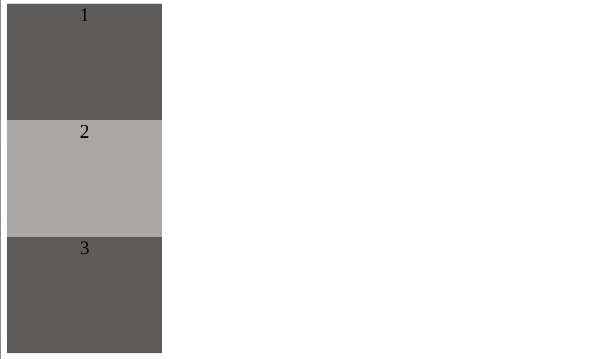

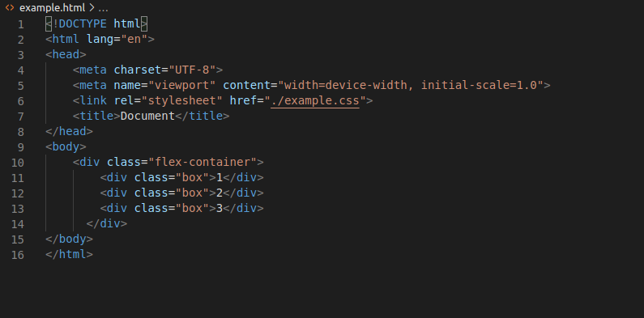

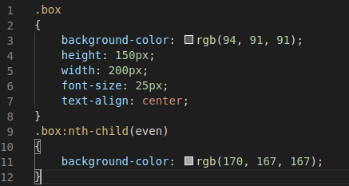

## To Get Started
We define our flex-container (parent container of flex-items) by giving it a property of **display** and value of  **flex** in our CSS.

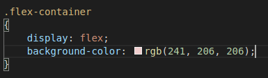

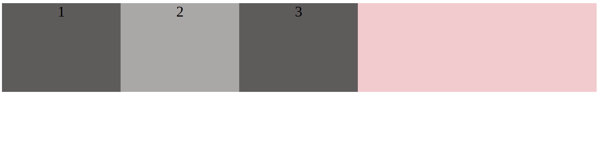

 
Our container acts like a block element but it’s children are displayed on the same line.

Flex items are laid out along 2 axes namely:
- **main-axis:** this is the primary axis along which the flex items are laid out (as rows across the page or columns down the page).
- **cross-axis:** this is the axis perpendicular to the main-axis.

> Note: The direction/position of the cross-axis would change depending on the direction of the main-axis & vice versa.

We can alter this by applying the CSS property **flex-direction** to our flex-container and setting the value to **row** or **column** (by default the main-axis is set to row). Other values like column-reverse and row-reverse can be used as well.

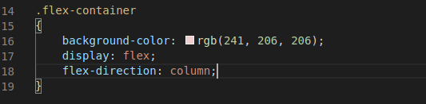

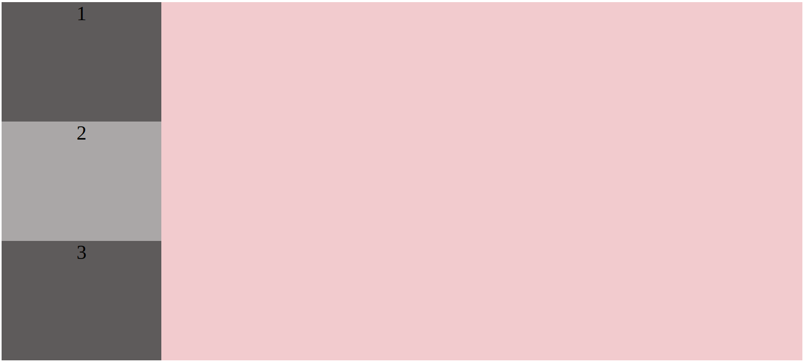

By default our flex-items want to fit into one line, but this would affect their individual widths if we have a fixed width for our flex-container.

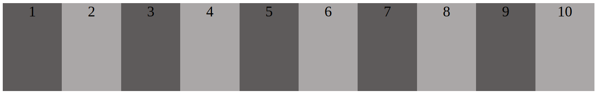

This can be fixed by adding a **flex-wrap** property to our flex-container which takes values of **no-wrap(default)**, **wrap** & **wrap-reverse**. Wrap, forces our flex-items to be contained in their parent container.

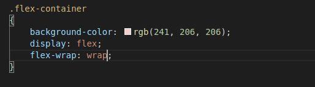

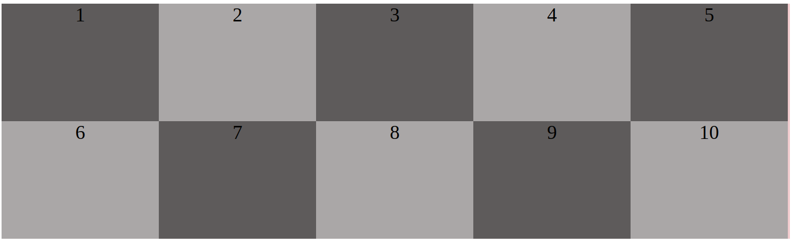

#### **Order**
Flex items are laid out how they appear in our source (HTML) but we can override this with the **order** property given to our flex-items without affecting our source order. The value, order takes are either **positive** or **negative integers**.

Note:
- All flex-items start with an order value of 0.
- Flex-items with higher order values from (1) appear in the ending parts when displakyed than lower order value items.
- Flex items with some order appear as they do in the source

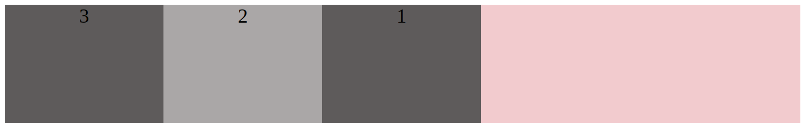

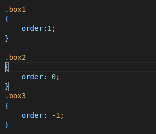

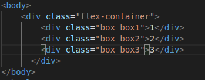

#### **Flex-grow & Flex-shrink**
These are properties given to a flex-item that causes them to **grow/shrink** in the container. They decide what amount of remaining space an item should take up (grow) or amount of overflowing space is taken away from the item (shrink). They take **positive integers** only as values.

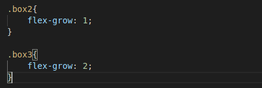

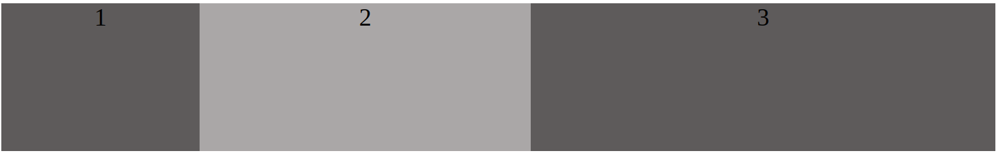

#### **Flex-basis**
This is a CSS property for our flex-items that specify their width/height (size) before any available space is given to them. Its values include: **auto**, **max-content**, **min-content**, **fit-content** e.t.c.

Recall that flexbox can be used to align our items and so far we have looked at how it can be used to layout or web page into rows and columns. Now, let us see ways we can align our items.

#### **Justify content**
It’s effect is seen on the main-axis of the flex-container. It controls how our flex-items are arranged on the main-axis. Some of the important values it goes with are:

- **flex-start (default):** items are arranged at the beginning of our main-axis.
- **flex-end:** items are arranged at the end of the main-axis.
- **center:** this positions our items in the center
- **space-around:** this distributes equal remaining space around each item from left to right. 
- **space-between:** this adds equal amount of space between each item.

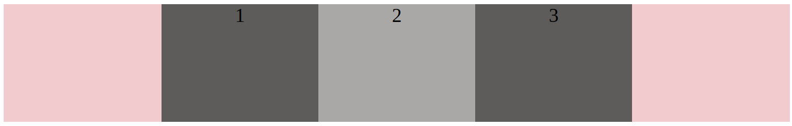

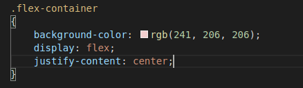

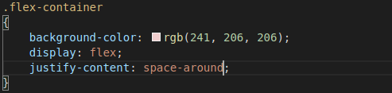

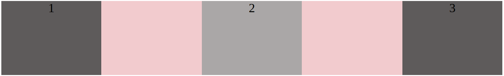

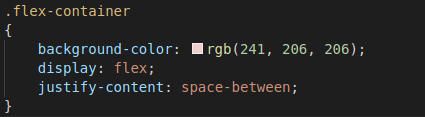

#### **Align-items**
This is  a property assigned to flex-container and controls how our flex-items are arranged on the cross-axis. Values that go with them include:

- **stretch:** this stretches our items to fill the parent-container.
- **flex-start:** items are arranged at the start of the cross-axis.
- **flex-end:** items are arranged at the end of the cross-axis.
- **center:** items are arranged centrally
- **baseline:** aligns items as their base-line aligns.

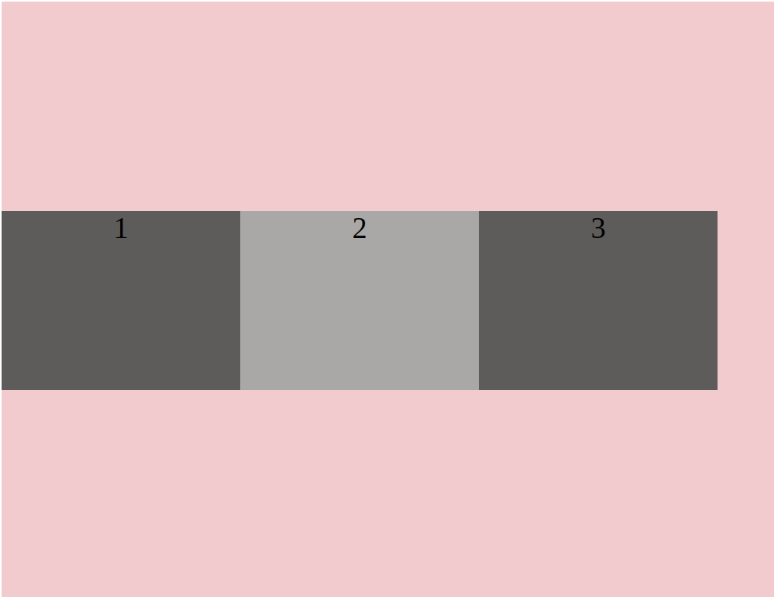

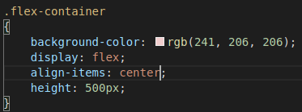

> Note: If the main-axis changes direction, so will the effect of justify content & align-items

#### **Align-content**
This aligns the flex-lines in a flex-container, along the crross-axis. It doesn’t work if the flex-line is one. Align content makes use of almost all values used by justify-content. Example: **flex-start**, **flex-end**, **space-around** , **space-between**, center e.t.c.

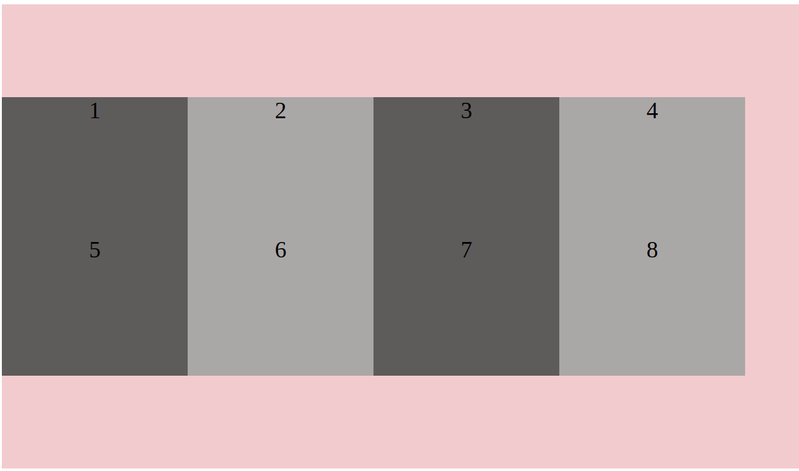

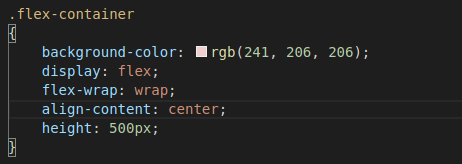

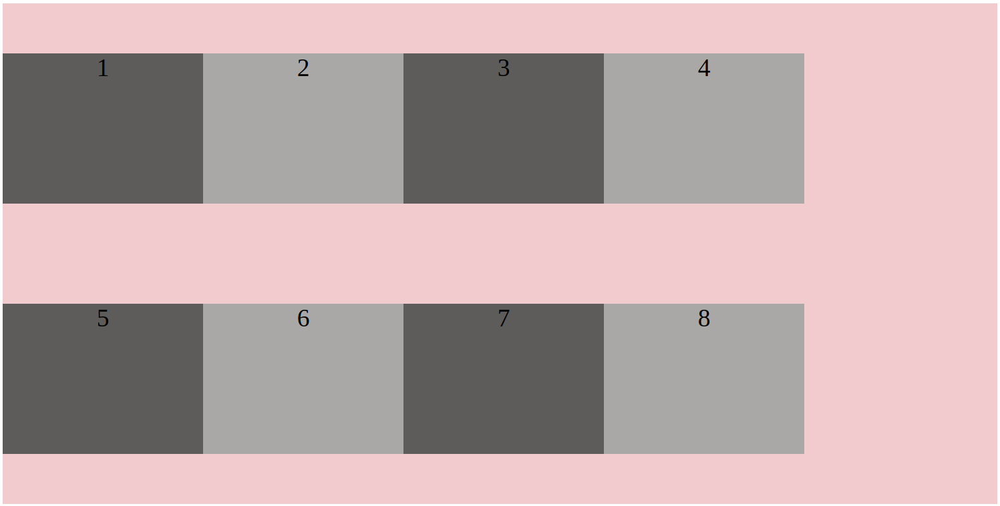

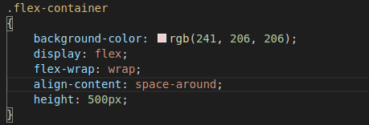

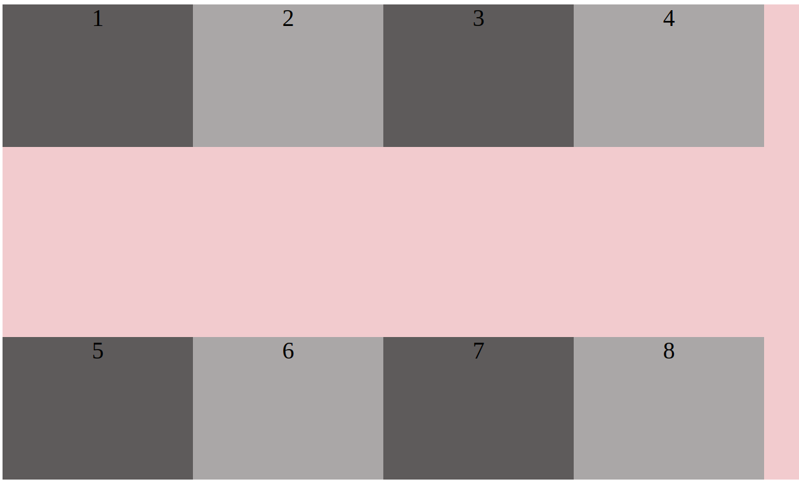

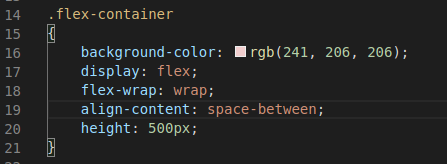

## Difference between align-items & align-content
Both work along the cross-axis but align-items acts on the flex-item in a flex-line but align-content works on all flex-lines in our parent container.

#### **Align-self**
We can override the default alignment of our flex-items or the effect of align-items property on our flex-items using align-self. This is a property attached to an individual item/child of our flex-container. It has the same values as align-items.

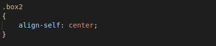

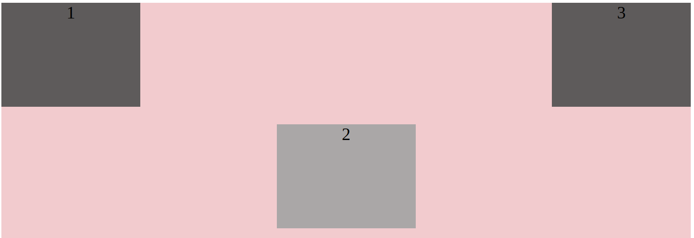

## Shorthands
To make our code cleaner & shorter, it is important for us to use shorthands. and some of the shorthands in flexbox include:

**flex-flow:** This is a shorthand for our flex-container which combines our flex-direction & flex-wrap.

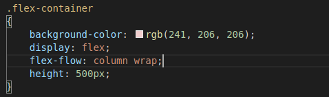

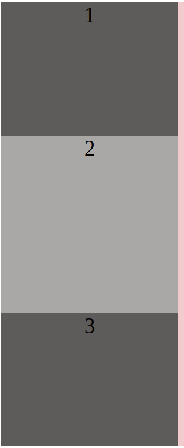

**flex:** This shorthand goes to our flex-item combining **flex-grow**, **flex-shrink** & **flex-basis** of which the last two (2) are optional.

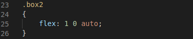

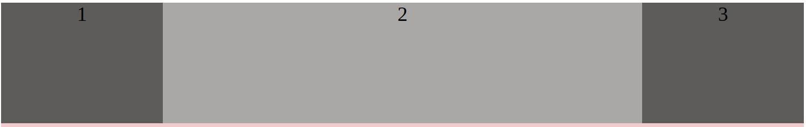

So there you have it. Congratulations on making it this far in this tutorial, I’m certain that you’ve learnt a thing or two. I'd encourage you to practice and research more as there are tons of information on the internet on this topic. Also watch out for more contents from me covering any topic on web development. Thanks.